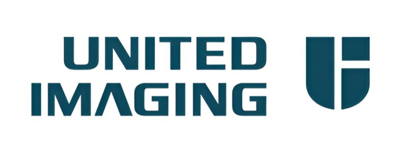
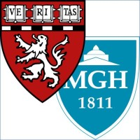








Hi! I am Tianyu Lin.👋 
<!-- I am a research assistant at the [Computational Cognitive Vision Lab (CCVL)](https://ccvl.jhu.edu/) at Johns Hopkins University, where I am fortunate to work with Bloomberg Distinguished Professor [Alan L. Yuille](https://www.cs.jhu.edu/~ayuille/) and Dr. [Zongwei Zhou](https://www.zongweiz.com/). -->
I am currently a research intern at [UII America, Inc.](https://www.uii-ai.com/), working with Dr. [Shanhui Sun](https://sites.google.com/site/shanhuisun), and a research assistant at [Massachusetts General Hospital](https://www.massgeneral.org/), Harvard Medical School, under the supervision of Professor [Xiang Li](https://researchers.mgh.harvard.edu/profile/15451263/xiangli-shaun.github.io). Previously, I was a research assistant in the [Computational Cognition, Vision, and Learning (CCVL)](https://ccvl.jhu.edu/) at Johns Hopkins University, where I was fortunate to work with Bloomberg Distinguished Professor [Alan L. Yuille](https://www.cs.jhu.edu/~ayuille/) and Dr. [Zongwei Zhou](https://www.zongweiz.com/).

I earned my Master’s degree in Biomedical Engineering from the Department of Biomedical Engineering at [Johns Hopkins University](https://www.jhu.edu/) in May 2025, and my Bachelor’s degree from the School of Biomedical Engineering at [Sun Yat-sen University](https://www.sysu.edu.cn/) in June 2024.

My research interest mainly includes medical image analysis and computer vision. I am all into building reliable medical vision intelligence systems. I am also interested in foundational vision models, diffusion models, vision language models, etc. If you are interested in working with me, please feel free to email me at [tianyulin67@gmail.com](mailto:tianyulin67@gmail.com) :)

# News
- *2025.06*: Two papers have been accepted by **MICCAI 2025**!
- *2025.01*: Two papers have been accepted by **ISBI 2025**. One paper has been accepted by **ESWA**.
- *2024.06*: 🥳🎉 One paper has been accepted by **MICCAI 2024** (1st author)!

# Publications & Preprints
&dagger;Corresponding author, \* Equal contribution
<!-- this is a divider =--><!-- this is a divider =--><!-- this is a divider =-->
<!-- this is a divider =--><!-- this is a divider =--><!-- this is a divider =-->

MICCAI 2025

### LEAF: Latent Diffusion with Efficient Encoder Distillation for Aligned Features in Medical Image Segmentation 

Qilin Huang, <b>Tianyu Lin</b>, Zhiguang Chen, and Fudan Zheng&dagger;

   

<!-- this is a divider =--><!-- this is a divider =--><!-- this is a divider =-->
<!-- this is a divider =--><!-- this is a divider =--><!-- this is a divider =-->

MICCAI 2025

### Learning Segmentation from Radiology Reports 

Pedro R. A. S. Bassi, Wenxuan Li, Jieneng Chen, Zheren Zhu, <b>Tianyu Lin</b>, Sergio Decherchi, Andrea Cavalli, Kang Wang, Yang Yang, Alan L. Yuille, Zongwei Zhou&dagger;

  

<!-- this is a divider =--><!-- this is a divider =--><!-- this is a divider =-->
<!-- this is a divider =--><!-- this is a divider =--><!-- this is a divider =-->

### PanTS: The Pancreatic Tumor Segmentation Dataset 

Wenxuan Li*, Xinze Zhou*, Qi Chen*, <b>Tianyu Lin</b>, Pedro R. A. S. Bassi, Szymon Plotka, Jaroslaw B. Cwikla, Xiaoxi Chen, Chen Ye, Zheren Zhu, Kai Ding, Heng Li, Kang Wang, Yang Yang, Yucheng Tang, Daguang Xu, Alan L. Yuille, Zongwei Zhou&dagger;

  

<!-- this is a divider =--><!-- this is a divider =--><!-- this is a divider =-->
<!-- this is a divider =--><!-- this is a divider =--><!-- this is a divider =-->

### EyePose: Pose-guided Saccadic Eye Movement Video Generation for Deep Learning-Based Neurologic Disease Phenotyping 

<b>Tianyu Lin</b>, Jooyoung Ryu, Puvada Sreevarsha, Rahul Srinivasaragavan, Riya Satavlekar, Susan Kim, Nidhi Soley, Yujie Yan, Ishan Vatsaraj, Carl Harris, Aimon Rahman, Vishal Patel, Joseph Greenstein, Casey Taylor, Kemar E. Green&dagger;

 

<!-- this is a divider =--><!-- this is a divider =--><!-- this is a divider =-->
<!-- this is a divider =--><!-- this is a divider =--><!-- this is a divider =-->

### Are Pixel-Wise Metrics Reliable for Sparse-View Computed Tomography Reconstruction? 

<b>Tianyu Lin</b>, Xinran Li, Chuntung Zhuang, Qi Chen, Yuanhao Cai, Kai Ding, Alan L. Yuille, Zongwei Zhou&dagger;

   

<!-- this is a divider =--><!-- this is a divider =--><!-- this is a divider =-->
<!-- this is a divider =--><!-- this is a divider =--><!-- this is a divider =-->

### Evaluating Large Language Models in Crisis Detection: A Real-World Benchmark from Psychological Support Hotlines 

Guifeng Deng, Shuyin Rao, <b>Tianyu Lin</b>, Anlu Dai, Pan Wang, Junyi Xie, Haidong Song, Ke Zhao, Dongwu Xu, Zhengdong Cheng, Tao Li, Haiteng Jiang&dagger;

 

<!-- this is a divider =--><!-- this is a divider =--><!-- this is a divider =-->
<!-- this is a divider =--><!-- this is a divider =--><!-- this is a divider =-->

### Text-driven Tumor Synthesis 

Xinran Li, Yi Shuai, Chen Liu, Qi Chen, <b>Tianyu Lin</b>, Pengfei Guo, Dong Yang, Can Zhao, Qilong Wu, Pedro R. A. S. Bassi, Daguang Xu, Kang Wang, Yang Yang, Alan Yuille, Zongwei Zhou&dagger;

   

<!-- this is a divider =--><!-- this is a divider =--><!-- this is a divider =-->
<!-- this is a divider =--><!-- this is a divider =--><!-- this is a divider =-->

### ScaleMAI: Accelerating the Development of Trusted Datasets and AI Models 

Wenxuan Li, Pedro R. A. S. Bassi, <b>Tianyu Lin</b>, Yu-Cheng Chou, Xinze Zhou, Fabian Isensee, Kang Wang, Qi Chen, Xiaoxi Chen, Yannick Kirchhoff, Maximilian Rouven Rokuss, Saikat Roy, Constantin Ulrich, Klaus Maier-Hein, Yucheng Tang, Kai Ding, Yang Yang, Alan Yuille, Zongwei Zhou&dagger;
****
   

<!-- this is a divider =--><!-- this is a divider =--><!-- this is a divider =-->
<!-- this is a divider =--><!-- this is a divider =--><!-- this is a divider =-->

ESWA

### A priority-guided contrastive network for delineating vascular layers in arterial ultrasound 

Minhua Lu*, <b>Tianyu Lin</b>*, Weiyuan Lin&dagger;, Zhaohui Li, Zhifan Gao

<!-- this is a divider =--><!-- this is a divider =--><!-- this is a divider =-->
<!-- this is a divider =--><!-- this is a divider =--><!-- this is a divider =-->

ISBI 2025

### EMSSD: Two-Stage Model Enhancing Medical Image Segmentation Based on Stable Diffusion 
<!--      -->

Ruiyue Chen, Xin Zhang&dagger;, <b>Tianyu Lin</b>, Sijin Yu

<!-- this is a divider =--><!-- this is a divider =--><!-- this is a divider =-->
<!-- this is a divider =--><!-- this is a divider =--><!-- this is a divider =-->

ISBI 2025

### PGP-SAM: Prototype-Guided Prompt Learning for Efficient Few-Shot Medical Image Segmentation 

Zhonghao Yan, Zijin Yin, <b>Tianyu Lin</b>, Xiangzhu Zeng, Kongming Liang&dagger;, Zhanyu Ma

 
   

<!-- this is a divider =--><!-- this is a divider =--><!-- this is a divider =-->
<!-- this is a divider =--><!-- this is a divider =--><!-- this is a divider =-->

MICCAI 2024

### Stable Diffusion Segmentation for Biomedical Images with Single-step Reverse process

<b>Tianyu Lin</b>, Zhiguang Chen, Zhonghao Yan, Weijiang Yu&dagger;, Fudan Zheng&dagger;

      

- `Sensors` An Attention-Based Co-Segmentation Semi-Supervised Method for Nasopharyngeal Carcinoma Segmentation. Chen Y&dagger;, Han G&dagger;, **Lin T** et al.

# Educations
- *2024.09-2025.05*, Master of Science in Engineering, Biomedical Engineering, Johns Hopkins University.
- *2020.09-2024.06*, Bachelor of Engineering, Biomedical Engineering, Sun Yat-sen University.

# Internships
- *2025.07-Now*, UII America Inc., , Boston, USA.
- *2025.07-Now*, Harvard Medical School and Massachusetts General Hospital, , Boston, USA.
- *2024.09-2025.07*, Computational Cognition, Vision, and Learning Research Group, , Baltimore, USA.
- *2023.07-2023.09*, Medical Imaging Center, , Shenzhen, China.
- *2022.07-2024.06*, National Supercomputer Center in Guangzhou, , Guangzhou, China.
- *2021.01-2024.06*, Health Informatics Computing Laboratory, , Shenzhen, China.

# Honors and Awards
- *2024.06*, Outstanding Undergraduate Thesis Award, School of Biomedical Engineering, Sun Yat-sen University.
- *2023.11*, Third-class scholarship for outstanding students, Sun Yat-sen University.
- *2022.12*, Second-class scholarship for outstanding students, Sun Yat-sen University.
- *2022.12*, 3rd Prize, The Mathematical Modeling Competition of Guangdong-Hong Kong-Marco Greater Bay Area.
- *2022.08*, 3rd Prize, National Biomedical Engineering Innovation Design Competition for College Students.
- *2021.11*, Second-class scholarship for outstanding students, Sun Yat-sen University.
